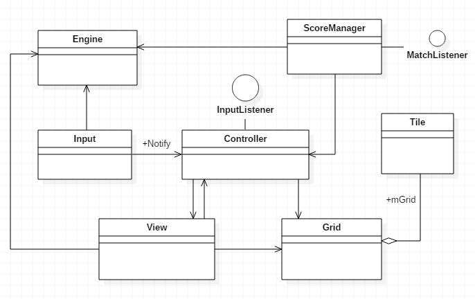
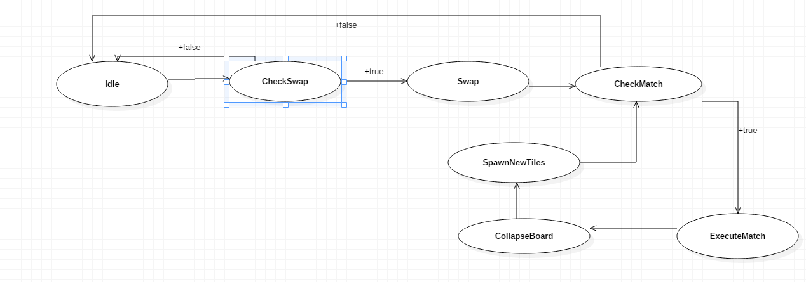

# MidasMinerClone
## A time-based match three clone

Key features:
- Randomly generated, 60 seconds long, time-based dynamic match three game
- 3-4-5 and cross matches are valid.
- Score is based on the matchedDiamondCount * 100
- Press any key to quit

Technical Notes:
- Grid.cpp contains all board data with vector<vector<Tile*>*>
- Tile.cpp has only object that would be rendered. When we want to implement other type of tiles, like boosters or obstacles, just inherit from Tile.cpp and use it.
- There are 5 pools that store 64 Tile object in each dynamicly to get rid of construction time at every Tile Create
- Controller.cpp is simply Controller. It listens user input, and responsible for all user actions, communicate with board and view.
- View.cpp is responsible for rendering, both objects and ui.
- ScoreManager is responsible for count the score and time.

Structurel Nots:
- The code base has MVC architecture that shown on the graph:

- The game logic implemented based on a state machine:

To Do:
- Animations (most curicial)
- Boosters (optional)
- Better score system, combos (optional)
- Better game transitions (start new game, quit game etc.)

What I Learned:
- C++ Slicing problem and how to solve it
- Some C++14 features, like range based for loops
- Erase-remove idom
- Need to be careful when working with two dimensional vectors, confusion with x and y might be terrible. 
Be consider to use one dimensional network to store next time.
- Think twice before implementing a real-time, interruptable game logic. State machines would be not enough for these type of tasks.

Good Reading:
- <a href="http://www.gamasutra.com/blogs/JonathanBailey/20150227/237544/Match_Game_Mechanics_An_exhaustive_survey.php" target="_blank">Match Game Mechanics</a>

Additional notes:
- Most challenging part of the project?

Obviously implementing animations and tweens on an interruptable (real-time) game logic. 
On this game, the player doesn't need to wait for that the logic complete and turn back to idle state.
This means player need to swap also when tiles are dropping or board is collapsing etc.
If it used to be a state based game, like logic and user must wait for animations, view part would be much easier to implement.
I tried lots of different implementation for animations and tweens but some of them spend much more memory (<a href="https://github.com/eusekerci/MidasMinerClone/commit/71c03f6015d2875b747a3c6b24d4c34255c50c6a">this commit</a>) and some of them doesnt work properly (<a href="https://github.com/eusekerci/MidasMinerClone/commit/d7d16e36f5e3c625d8a95e5ffbd5642970407694">this commit</a>).
So, it would be better without animations for the game feel and playability.

- Additional features?

Actually I would like to add boosters and I implemented the sustainable and extendable code base. 
However, completing the main task on the time would be better than adding additional features after deadline.

- Struggle with C++?

It was really good practice for making from scratch. It force me to think with MVC and stick with programming patterns.
I've faced some common problems which I didn't faced in C# before, like Slicing Problem, but I found the solutions and learn.